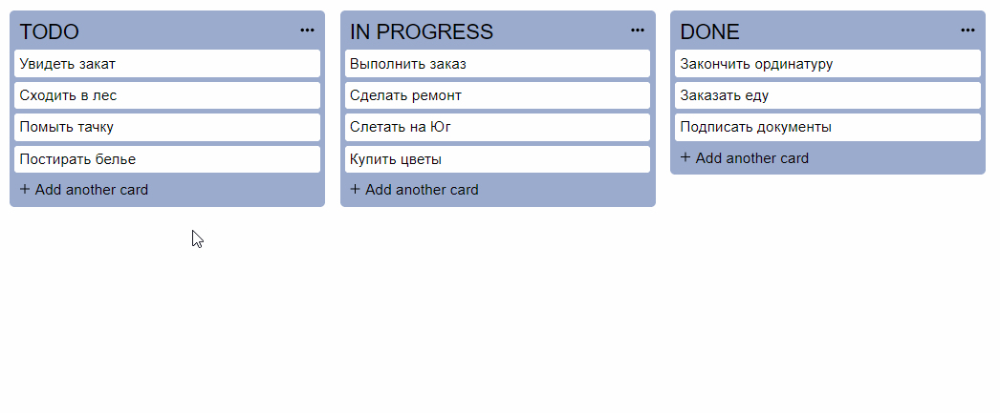

## Trello copy

 

Реализована копия внутрикорпоративной системы управления задачами **Trello**.

 

1. __Добавить новую карточку__ можно с помощью кнопки 'Add another card'.
2. Архивация задач заменена на функцию __удаления карточки__. Если необоходимо удалить карточку - необоходимо навести курсор на карточку - появляется иконка крестик, которая и удаляет карточку.
3. __Перемещать карточки__ внутри колонки, так и между колонками, возможно с помощью зажатия правой кнопки мыши на карточке.
4. Все карточки сохраняются в __localStorage__, и при обновлении страницы не обнуляются.

 

В данной реализации нет возможности:
-   добавлять изображения
-   изменять цвет карточек
-   создавать списки 

